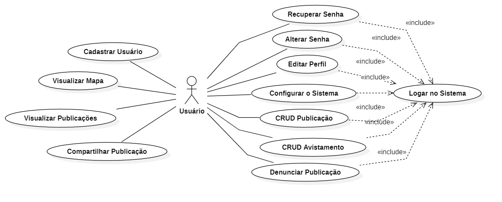
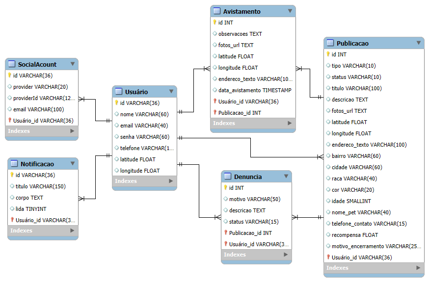
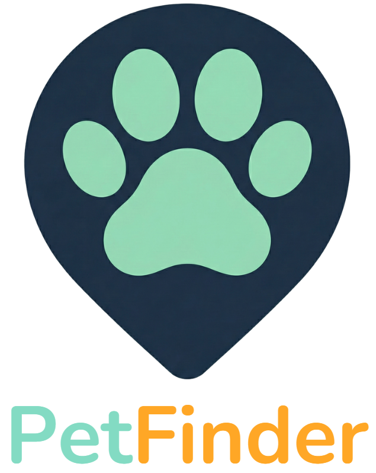
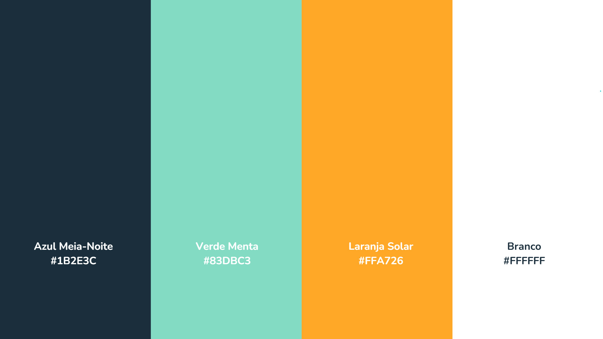

# Documentação do Projeto PetFinder

## 🐾 PetFinder
**Conectando pets perdidos aos seus lares.**

O **PetFinder** é uma plataforma desenvolvida para auxiliar na reunião entre pets perdidos e seus tutores, bem como ajudar pets resgatados a encontrarem um novo lar. O projeto busca centralizar as informações, utilizando geolocalização e engajamento comunitário para resolver o problema de animais desaparecidos de forma rápida e dinâmica.

Este projeto faz parte da disciplina de **Projeto de Desenvolvimento I** da **UniSenac Pelotas**, sob orientação do professor **Angelo Luz**.

🔗 **Acesse o projeto:** [https://petfinder-self.vercel.app](https://petfinder-self.vercel.app)

---

## 🧐 O Problema
Diariamente, as redes sociais são inundadas por postagens de pessoas buscando pets perdidos ou tentando doar animais resgatados.

*   **Perda de visibilidade:** As postagens se perdem no feed, somem após 24 horas (stories) ou ficam restritas a bolhas de seguidores.
*   **Ineficiência:** Publicações muitas vezes não alcançam o público local relevante e recebem apenas curtidas de comoção, sem colaboração efetiva.

## 💡 A Solução
O PetFinder resolve isso através de um sistema focado e geolocalizado:

*   **Notificações Inteligentes:** O sistema notifica automaticamente todos os usuários próximos sobre uma nova publicação.
*   **Interação por Avistamentos:** Usuários podem informar ter visto um animal (com local e hora exata) sem precisar resgatá-lo, atualizando o status para toda a comunidade.
*   **Mapa Interativo:** Exibição de pinos no mapa diferenciados por cores (perdidos, encontrados, adoção) e locais de avistamentos.

---

## 👥 Personas
O desenvolvimento foi guiado pelas dores e objetivos de três perfis principais:

### 1. Ana Clara (28 anos, Analista de Marketing)
*   **Cenário:** Seu cachorro, Pipoca, fugiu pelo portão da garagem.
*   **Dores:** Pânico; acha grupos de Facebook desorganizados; medo que o pet vá longe demais.
*   **Objetivos:** Notificar pessoas da região rapidamente; receber informações em tempo real; organizar onde já procurou.

### 2. Seu João (62 anos, Aposentado)
*   **Cenário:** Viu um cachorro de raça, assustado, durante sua caminhada.
*   **Dores:** Quer ajudar mas não pode levar o animal para casa; não sabe quem é o dono; não quer burocracia.
*   **Objetivos:** Avisar o tutor rapidamente sem preencher cadastros longos.

### 3. Beatriz (35 anos, Veterinária e Fundadora de ONG)
*   **Cenário:** ONG superlotada, precisa doar animais para resgatar novos.
*   **Dores:** Não consegue resgatar novos pets por falta de espaço; posts em redes sociais "morrem" rápido; resgata animais que já têm dono sem saber.
*   **Objetivos:** Dar visibilidade aos animais para adoção; verificar rapidamente se um animal resgatado já está sendo procurado na região.

---

## 🛠️ Tecnologias Utilizadas

### Frontend
*   **Next.js:** Framework principal (roteamento, renderização híbrida, otimização).
*   **TypeScript:** Facilidade de desenvolvimento e manutenção.
*   **Tailwind CSS:** Estilização rápida, responsiva e consistente.
*   **shadcn/ui & Radix UI:** Componentes reutilizáveis e acessíveis.
*   **Lucide React:** Biblioteca de ícones leve e consistente.
*   **React Leaflet:** Renderização do mapa interativo e pinos.
*   **OpenStreetMap / Nominatim:** API gratuita para geocoding (endereço ↔ coordenadas).
*   **html2canvas:** Geração de pôsteres para compartilhamento.
*   **Web Share API:** Invocação do menu nativo de compartilhamento do celular.
*   **Google Identity Service:** Login via Google.
*   **Context API & Zod:** Gerenciamento de estado global e validação de esquemas.
*   **Fetch API:** Comunicação com o Backend.

### Backend
*   **Node.js & Express.js:** Ambiente de execução e framework para API REST.
*   **TypeScript:** Manutenibilidade do código.
*   **PostgreSQL & Prisma ORM:** Banco de dados relacional robusto e interação segura.
*   **JWT (JSON Web Token):** Autenticação segura.
*   **Bcrypt:** Hash de senhas para segurança.
*   **Google Auth Library:** Integração oficial de login social.

### Segurança
*   **Helmet:** Proteção via cabeçalhos HTTP.
*   **CORS:** Controle de acesso entre origens.
*   **Express Rate Limit:** Proteção contra DDoS e força bruta.
*   **Multer & Cloudinary:** Upload e armazenamento de imagens na nuvem.
*   **Validação & Logs:** Zod, Express Validator e Winston.
*   **Nodemailer:** Envio de e-mails.
*   **Swagger:** Documentação interativa da API.

### Infraestrutura
*   **Docker, Docker Compose e PM2:** Gerenciamento de processos e containers.

---

## 📋 Requisitos e Regras de Negócio

### Requisitos Funcionais
*   **Gerenciamento de Conta:** Cadastro, login, edição de perfil e recuperação de senha.
*   **Publicações:** Criação, edição e upload de fotos de pets.
*   **Sistema de Alertas:** Notificação automática via geolocalização (e-mail ou app).
*   **Visualização:** Mapa interativo, feed e filtros avançados.
*   **Interação:** Relato de avistamentos em publicações de terceiros.
*   **Encerramento:** Finalização de casos com registro do motivo.

### Regras de Negócio
*   **Unicidade:** E-mail único por cadastro.
*   **Validação:** Verificação em tempo real de formatos de dados e complexidade de senha.
*   **Status:** Enumeração estrita (ativo, resolvido, etc.).
*   **Raio de Notificação:** Cálculo geoespacial via Fórmula de Haversine para determinar distância entre publicação e usuários.
*   **Privacidade:** Localização exata do usuário usada apenas para cálculos, não exposta.
*   **Confirmação:** Interfaces de diálogo para ações críticas.

### Requisitos Não-Funcionais
*   **Responsividade:** Classes responsivas (mobile/desktop).
*   **Segurança:** Prevenção de SQL Injection (Prisma), hash de senhas (Bcrypt) e privacidade de dados sensíveis.
*   **Usabilidade:** Interfaces intuitivas e modo alto contraste.
*   **Confiabilidade:** Logs de auditoria.
*   **Escalabilidade:** Uso de containers Docker.
*   **Manutenibilidade:** Arquitetura modular e tipagem estrita.

---

## 🏗️ Estrutura de Dados e Diagramas

* **🧩 Diagrama de Casos de Uso**

* **🗂️ Diagrama Entidade-Relacionamento**

---

## 🎨 Identidade Visual

### Logo

Formato de um pino de mapa (rastreamento) com uma pegada de animal no centro (conceito de "encontrar"). Design minimalista.

### Paleta de Cores

* **Azul Meia-Noite** Tecnologia, seriedade e confiança. Reduz cansaço visual.
* **Verde Menta** Esperança e serenidade. Contraponto emocional ao estresse.
* **Laranja Solar** Energia e alerta. Usado em botões de ação sem causar pânico.
* **Branco** Clareza e limpeza. Fundo do sistema.

### Fontes

*   **Nunito:** Arredondada e amigável, usada na marca e títulos para transmitir acolhimento.
*   **Inter:** Moderna e limpa, utilizada como padrão no sistema pela alta legibilidade.

---

## 💰 Modelo de Negócios
*   **Inicial:** Anúncios de maneira não agressiva.
*   **Futuro:** Taxas sobre serviços oferecidos no sistema com a expansão da plataforma.

---

## 🔮 Próximos Passos (Roadmap)
*   **Implementação de IA:** Busca visual para identificar se a foto de um pet perdido combina com algum já encontrado no banco de dados.
*   **Busca Semântica:** Permitir buscas textuais complexas (ex: "cachorro preto centro pelotas").
*   **Resgates:** Funcionalidade para solicitar ajuda em resgates de risco (ex: gato em local de difícil acesso).
*   **Eventos:** Divulgação de feiras de adoção e bingos beneficentes.
*   **Marketplace de Serviços:** Cadastro de Pet Sitters, Dog Walkers e Petshops, similar a um "iFood de serviços pet".

---

## ✅ Conclusão
O PetFinder entrega uma plataforma robusta, segura e escalável. Utilizando tecnologias modernas como Docker e Geolocalização (Geofencing), o sistema oferece uma experiência de usuário agradável e acessível, cumprindo sua missão de usar a tecnologia a favor da comunidade e do bem-estar animal.
